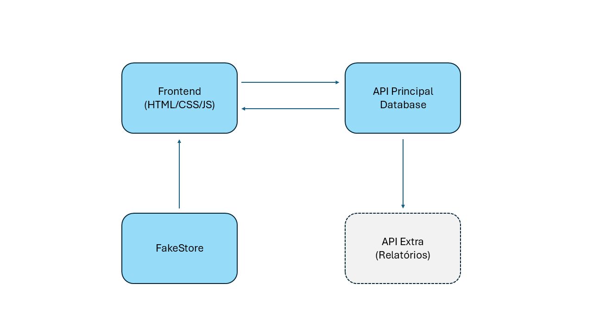

# 🧩 Espaços Publicitários – Backend + Frontend (MVP Completo)

Este projeto tem como objetivo o gerenciamento de espaços publicitários físicos em uma rede varejista, permitindo o controle de ativações por loja, marca, status e descrição dos espaços. A aplicação é composta por um **frontend (HTML/CSS/JS)**, uma **API backend (Flask + SQLite)** e um **microserviço adicional de relatórios** (executado separadamente).

---

## 📦 Estrutura dos diretórios

```
espacos-publicitarios-backend/
├── app/
│   ├── __init__.py
│   ├── models.py
│   └── routes.py
├── static/
│   └── swagger.json
├── Dockerfile
├── docker-compose.yml
├── requirements.txt
├── run.py

espacos-publicitarios-frontend/
├── index.html
├── style.css
├── script.js
├── Dockerfile
```

---

## 🧱 Tecnologias Utilizadas

- Python 3.10 + Flask
- SQLite + SQLAlchemy
- JavaScript (vanilla)
- HTML + CSS
- Swagger UI
- FakeStore API (componente externo REST)
- Docker + Docker Compose
- Nginx (para servir o frontend)

---

## 🚀 Como executar (primeira vez)

> Requisitos: Docker e Docker Compose instalados

1. Baixe os dois diretórios:
   - `espacos-publicitarios-backend`
   - `espacos-publicitarios-frontend`

2. Certifique-se de que o `docker-compose.yml` está no diretório do backend e que o caminho de build do frontend aponta corretamente para `../espacos-publicitarios-frontend`

3. No terminal, acesse o diretório do backend:

```bash
cd espacos-publicitarios-backend
```

4. Execute a aplicação (frontend + backend):

```bash
docker-compose up --build
```

5. Acesse os serviços no navegador:

- 🖥️ Frontend: [http://localhost:3000](http://localhost:3000)
- ⚙️ API Principal: [http://localhost:5000](http://localhost:5000)
- 📄 Swagger da API: [http://localhost:5000/swagger](http://localhost:5000/swagger)

---

## 📌 Funcionalidades

### 🖥️ Frontend

- Listagem de espaços
- Filtro por loja
- Contagem de espaços (total, disponíveis, ocupados)
- Atualização de marca via dropdown
- Exclusão de espaços
- Cadastro de novo espaço via modal
- Anúncios simulados via FakeStore API (exibidos na lateral)

### 🔌 Backend (API Principal)

- `GET /espacos` – Listar espaços
- `GET /marcas` – Listar marcas
- `POST /espacos` – Criar novo espaço
- `PUT /espacos/{id}` – Atualizar marca
- `DELETE /espacos/{id}` – Excluir espaço
- Swagger disponível em `/swagger`

---

## 🌐 Integrações

| Serviço                   | Uso                                                   |
|---------------------------|--------------------------------------------------------|
| FakeStore API             | Produtos simulados como anúncios no frontend          |
| API principal (Flask)     | Fornece todos os dados via REST                       |
| Microserviço de relatórios| Executado separadamente (não incluso neste Compose)   |

---

## 🗺️ Arquitetura da Aplicação



---

## ✅ Requisitos Atendidos

- ✅ CRUD completo (GET, POST, PUT, DELETE)
- ✅ Integração entre frontend e backend via REST
- ✅ Swagger da API principal documentado
- ✅ Consumo de API externa (FakeStore)
- ✅ Containers separados (frontend, backend)
- ✅ Dockerfile e Docker Compose
- ✅ Arquitetura ilustrada conforme exigência

## ✉️ Autor

Gean Cunha – [MVP - Pós PUCRIO - Engenharia de Software]

